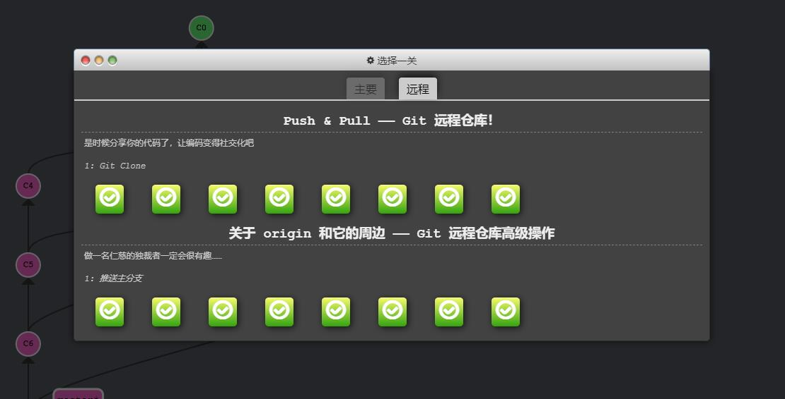
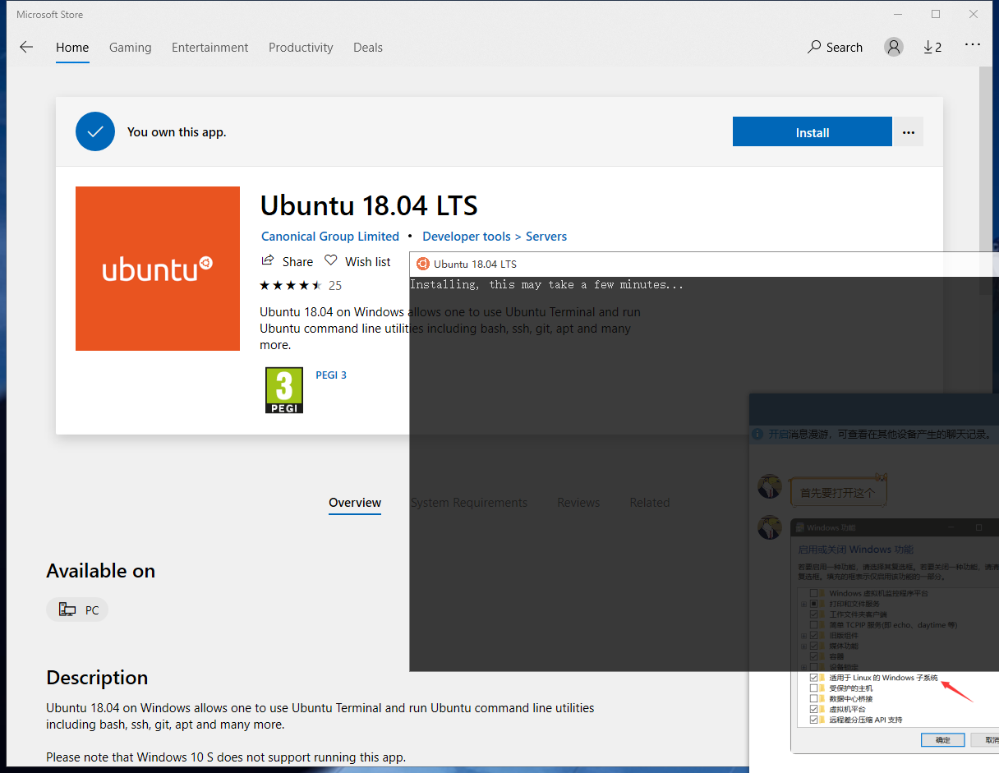
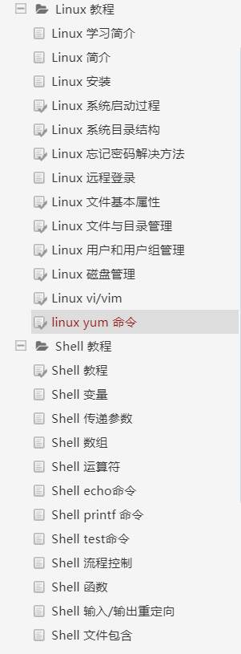

# 一

## 学习时间
2:30am ~ 4:00am(1.5h)

## 学习内容
主要是学习git，在pdf给出的网站中学习，通关了主要部分

## 学习总结

这个网站真好玩，我第一次学git的时候是在廖雪峰的网站上学的，如果可以早点知道这个网站就好了。

感觉背景颜色有点瞎眼，后来换了chrome装了restyle插件把背景改成灰色的了。

# 二

## 学习时间

2:00pm ~ 5:30pm(3.5h)

## 学习内容

先把那个网站剩下的关卡给通关了。

然后开始学linux基础，先装了wsl（window下的linux子系统）

然后在[W3C的linux教程](https://www.w3cschool.cn/linux/linux-yum.html)学习

目前学到了vim编辑器的部分

## 学习总结

linux系统用的不多，之前都是要用什么命令就直接现场查，这次系统学习一下。