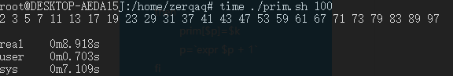
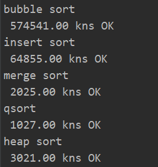

# 一
## 学习时间
4:00am ~ 7:30am (3.5h)

## 学习内容
看完了[WC3的linux教程](https://www.w3cschool.cn/linux/linux-yum.html)

写了一个输出1~n的所有素数的bash脚本作为练习

```bash

#!/bin/bash

isPrim(){
        n=`expr $1`
        for i in $(seq 2 `expr $n - 1`)
        do
                if [ `expr $i \* $i` -gt $n ]
                then
                        return 1
                fi
                if [ `expr $n / $i \* $i` -eq $n ]
                then
                        return 0
                fi
        done
        return 1
}

n=`expr $1`
p=0
for k in $(seq 2 `expr $n - 1`)
do
        isPrim $k
        if [ $? -eq 1 ]
        then
                prim[$p]=$k
                p=`expr $p + 1`
        fi
done

echo ${prim[*]}

```



开始写算法和数据结构部分，目前完成了插入、冒泡、归并排序的编写。

## 学习总结

bash脚本好慢啊

# 二

## 学习时间
18:00pm ~ 22:00pm (4h)

## 学习内容

把排序、树的遍历写完了。

每次自己遍历的结果都会和std::sort的遍历结果进行对比，如果一样就输出OK。

顺便还用chrono里的nanoseconds给每种排序计时了一下。



时间复杂度分析放代码注释里了。

## 学习总结

因为高中打过OI，所以很快就写完了，而且一直边写边和学长聊天划水（）